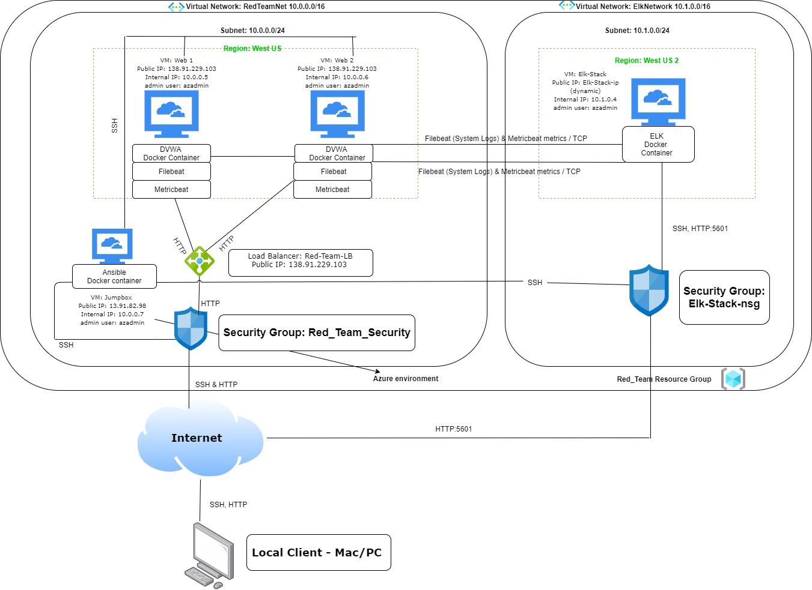
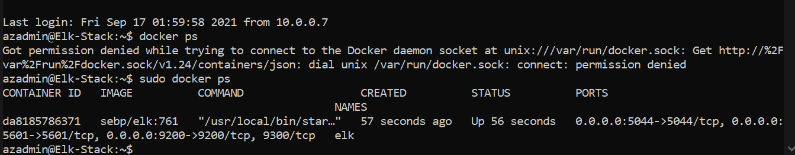
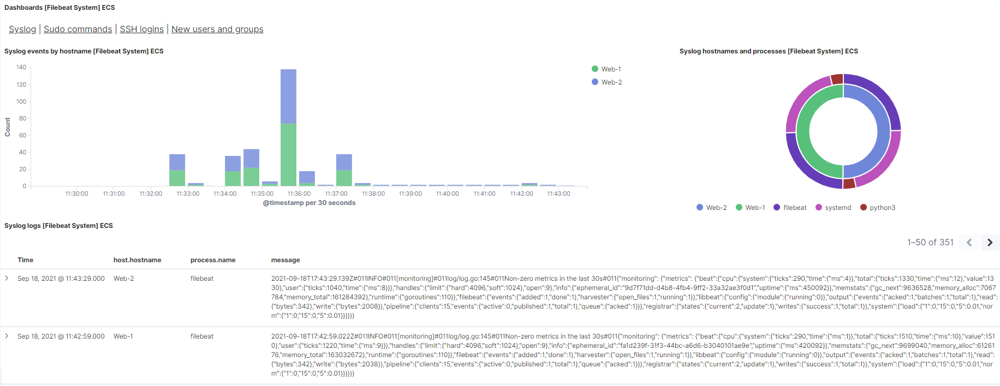
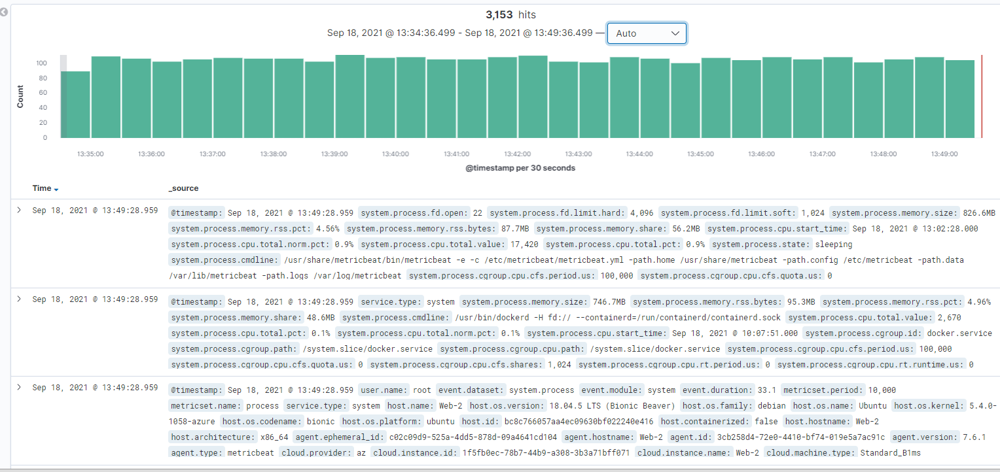

## Automated ELK Stack Deployment

The files in this repository were used to configure the network depicted below.

These files have been tested and used to generate a live ELK deployment on Azure. They can be used to either recreate the entire deployment pictured above. Alternatively, select portions of the playbook file may be used to install only certain pieces of it, such as Filebeat.

  - [install-elk.yml](https://github.com/kesharp28/Bootcamp-Cyber-Project-1/blob/main/Ansible/install-elk.yml)
  - [my-playbook1.yml](https://github.com/kesharp28/Bootcamp-Cyber-Project-1/blob/main/Ansible/my-playbook1.yml)
  - [filebeat-playbook.yml](https://github.com/kesharp28/Bootcamp-Cyber-Project-1/blob/main/Ansible/filebeat-playbook.yml)
  - [metricbeat-playbook.yml](https://github.com/kesharp28/Bootcamp-Cyber-Project-1/blob/main/Ansible/metricbeat-playbook.yml)

This document contains the following details:
- Description of the Topology
- Access Policies
- ELK Configuration
  - Beats in Use
  - Machines Being Monitored
- How to Use the Ansible Build

### Description of the Topology

The main purpose of this network is to expose a load-balanced and monitored instance of DVWA, the D*mn Vulnerable Web Application.

Load balancing ensures that the application will be highly available, in addition to restricting access to the network.

- Load balancers efficiently distribute incoming network traffic routing client requests across all servers capable of fulfilling those requests and ensures high availability to all applications. 
- The advantage of using a Jump Box in this situation is that it minimizes the attack surface by ensuring remote connections to the cloud network only come through a single VM. Then those remote connections to the Jump Box can be monitored more easily with a single audit trail.  

Integrating an ELK server allows users to easily monitor the vulnerable VMs for changes to the configuration and system files.
- Filebeat is used to monitor log files. 
- Metricbeat is used to collect operating system and service statistics from monitored VM's and servers.

The configuration details of each machine may be found below.
| Name                 | Function | IP Address | Operating System |
| -------------------- | -------- | ---------- | ---------------- |
| Jump-Box-Provisioner | Gateway  | 10.0.0.7   | Linux            |
| Web-1                | DVWA     | 10.0.0.5   | Linux            |
| Web-2                | DVWA     | 10.0.0.6   | Linux            |
| Elk-Stack            | ELK      | 10.1.0.4   | Linux            |

### Access Policies

The machines on the internal network are not exposed to the public Internet. 

Only the Jump Box machine can accept SSH connections from the Internet. Access to this machine is only allowed from the following IP addresses:
- _TODO: Add whitelisted IP addresses_

Machines within the network can only be accessed by the Jump Box.
- The Jump Box can access the ELK VM Elk-Stack using SSH. The Jump Box's IP address is 10.0.0.7.

A summary of the access policies in place can be found in the table below.

| Name                 | Publicly Accessible | Allowed IP Addresses                  | Allowed Ports |
| -------------------- | ------------------- | ------------------------------------- | ------------- |
| Jump-Box-Provisioner | Yes                 | Personal IP Address 10.0.0.5 10.0.0.6 | 22            |
| Web-1                | Yes                 | 10.0.06 10.1.0.4                      | 80            |
| Web-2                | Yes                 | 10.0.0.5 10.1.0.4                     | 80            |
| Elk-Stack            | Yes                 | 10.0.0.5 10.0.0.6                     | 5601          |

### Elk Configuration

Ansible was used to automate configuration of the ELK machine. No configuration was performed manually, which is advantageous because...
- The build and deployment is performed automatically, consistently, and quickly.
- The system installation and updates can be streamlined and the process can be be more replicable.  

The playbook implements the following tasks:

Playbook 1: my-playbook1.yml

- Installs Docker
- Installs Python
- Installs Docker's Python Module
- Downloads and launches the DVWA Docker container

Playbook 2: install-elk.yml

- Installs Docker
- Installs Python
- Installs Docker's Python Module
- Increase virtual memory to support the ELK stack
- Increase memory to support the ELK stack
- Download and launch the Docker ELK container

Playbook 3: filebeat-playbook.yml

- Downloads and installs Filebeat
- Enables and configures the system module
- Configures and launches Filebeat

Playbook 4: metricbeat-playbook.yml

- Downloads and installs Metricbeat
- Enables and configures the docker module for Metricbeat
- Configures and launches Metricbeat

The following screenshot displays the result of running `docker ps` after successfully configuring the ELK instance.

### Target Machines & Beats
This ELK server is configured to monitor the following machines:
- Web-1: 10.0.0.5
- Web-2: 10.0.0.6

We have installed the following Beats on these machines:
- Filebeat
- Metricbeat

These Beats allow us to collect the following information from each machine:

- Filebeat monitors the log files, collects log events, and forwards them to ELK from the VM's running the Filebeat agent.
- Metricbeat collects metrics from the operating system and services of VM's running the Metricbeat agent. 

### Using the Playbook
In order to use the playbook, you will need to have an Ansible control node already configured. Assuming you have such a control node provisioned: 

SSH into the control node and follow the steps below:
- Copy the playbook file to the Ansible Docker Container.

- Update the Ansible hosts file /etc/ansible/hosts to include the following:

  ​	[webservers]

  ​	 10.0.0.5 ansible_python_interpreter=/usr/bin/python3

   	10.0.0.6 ansible_python_interpreter=/usr/bin/python3

  ​	[elkservers]

  ​	 10.1.0.4 ansible_python_interpreter=/usr/bin/python3

- Update the Ansible configuration file /etc/ansible/ansible.cfg and set the remote_user parameter to the admin of the user of the web servers.

Running the Playbooks

1. Start an ssh session with the Jump Box ~$ ssh azadmin@<Jump Box Public IP>
2. Start the Ansible Docker container ~$ sudo docker start <Ansible Container Name>
3. Attach to the Ansible Docker container ~$ sudo docker attach <Ansible Container Name>
4. Run the playbooks with the following commands:
    * ansible-playbook /etc/ansible/my-playbook1.yml
    * ansible-playbook /etc/ansible/install-elk.yml
    * ansible-playbook /etc/ansible/roles/filebeat-playbook.yml
    * ansible-playbook /etc/ansible/roles/metricbeat-playbook.yml
5. The Elk playbook, install-elk.yml,  configures the server listed as [elkservers] in /etc/ansible/hosts
6. Also the Metricbeat and Filebeat playbooks, metricbeat-playbook.yml and filebeat-playbook.yml, configure the servers listed as [webservers] in /etc/ansible/hosts.
7. After running the playbooks and getting no errors in the output then navigate to Kibana to check that the installation worked as expected by viewing Filebeat and Metricbeat data and reports in the Kibana Dashboard as seen below. 
   * Kibana can be accessed by navigating to [http://<elk-server-ip>:5601/app/kibana](http://,elk-server-ip>:5601/app/kibana)

